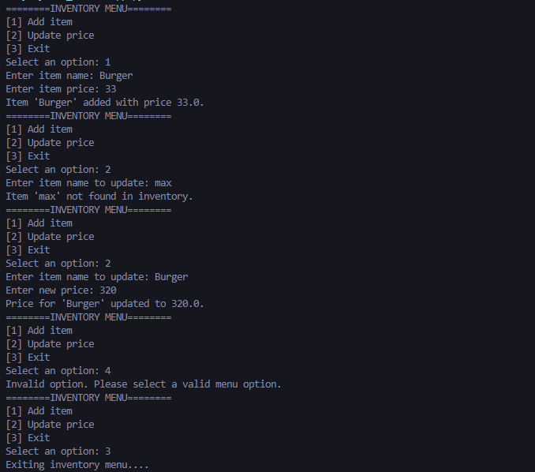

# Python Inventory System

## Description

This is an inventory program that uses the following data structures:
A list to store item names
A dictionary to store the corresponding item prices

### The program should allow the user to:

1. Add a New Item
- To input an item name and price
- Add it to both the list and dictionary
- Prevent duplicate item names
2. Update the price of an existing item
- Ask for the item name
- If it exists, update its price
- If it doesn't exist, it shows an error message

#### Note: This program uses loops and conditionals and does not include deleting items or out-of-stock features..

# Sample Output

# The Handsome Creator:
### DM Rashid P. Ferrer

# Screenshot of running program
